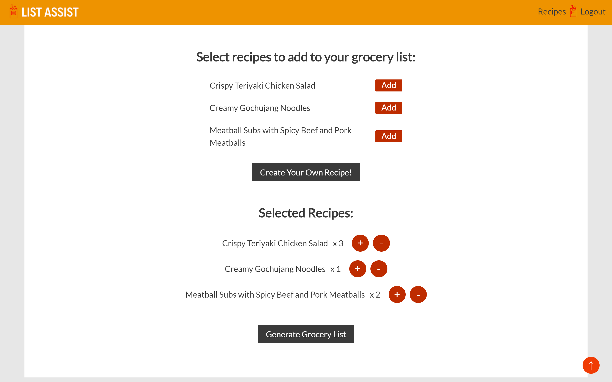
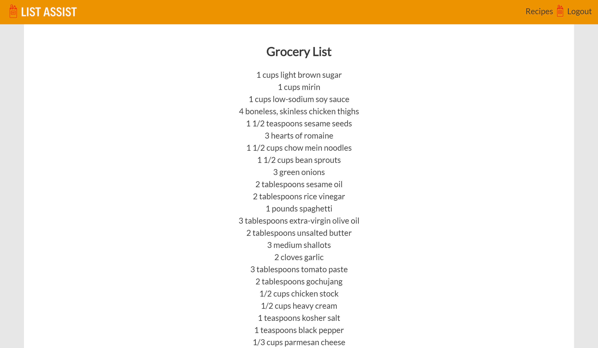
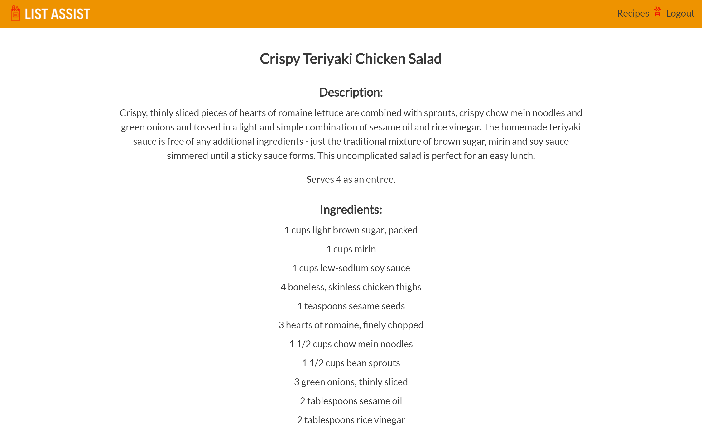
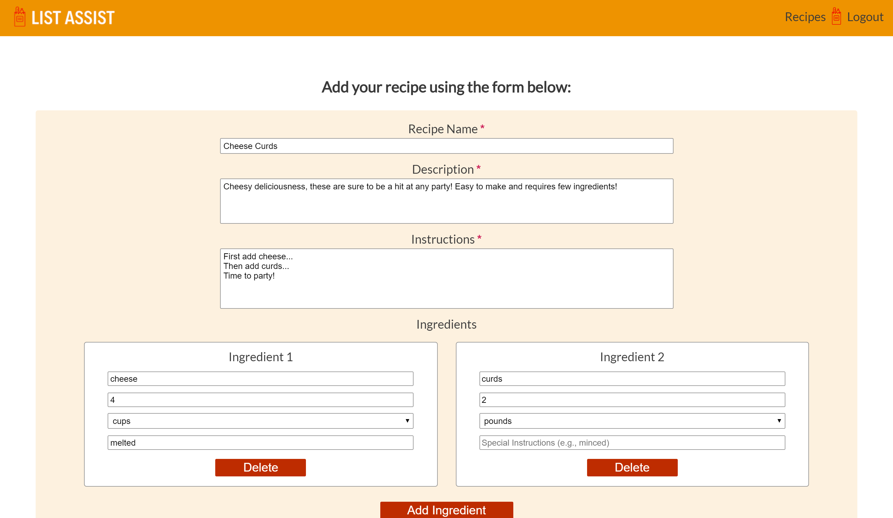

# LIST ASSIST

## Description:

A full stack web app that automates grocery list preparation by providing users with consolidated, system-generated grocery lists based on their selection from both default and custom recipes.

## User Access:

Registered users can view default recipes provided by the app, as well as create, read, update, and delete their own recipes, enabling them to generate grocery lists from both default and custom recipes. 

Guest users are limited to read-only access, but do have the ability to generate grocery lists using the default recipes provided in the app.

## Demo:

- [List Assist Live App](https://ryanjeske-list-assist.now.sh/)

## Screenshots

### Home Page:

### Recipe Selection Screen:

### Grocery List Screen: 

### Recipe Screen:

### Add Recipe Screen:

## Build With

### Client-Side:
* React
* CSS3

### Server-Side:
- [List Assist API](https://github.com/ryanjeske14/list-assist-api)

### Acknowledgments:
- [Fraction.js](https://www.npmjs.com/package/fraction.js)

